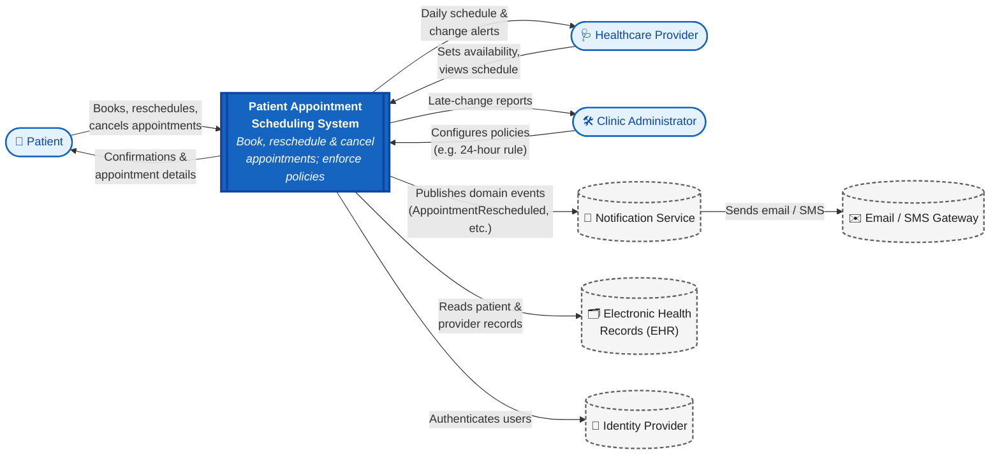
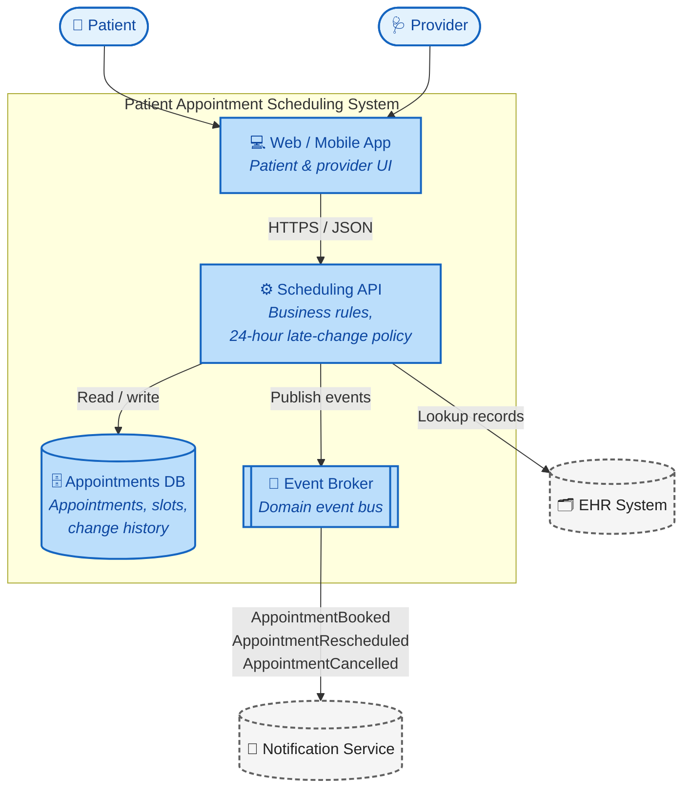
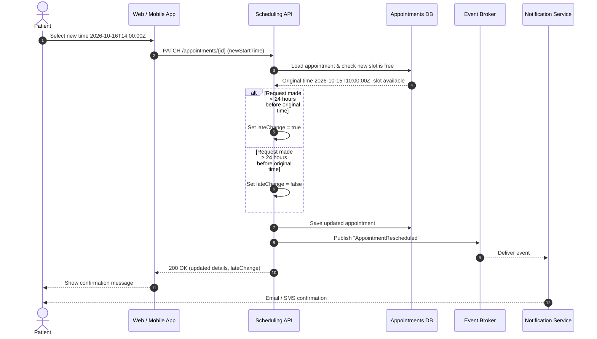

# Patient Appointment Scheduling System
## Context Diagrams & User Stories with Gherkin Acceptance Criteria

| Item | Details |
|------|---------|
| **Programme** | BSc ICT |
| **Assignment** | Week 2 — Context Diagrams & User Stories (Individual Submission) |
| **Student Name** | Amoako Christopher |
| **Student ID** | 226004600 |
| **Lecturer** | Samuel Odoi Laryea |
| **Submission Date** | 1 October 2026 |

---

## Table of Contents

1. [Project Overview](#1-project-overview)
2. [Conventions](#2-conventions)
3. [Context Diagrams](#3-context-diagrams)
4. [User Stories](#4-user-stories)
5. [Definition of Done](#5-definition-of-done)
6. [Appendix A — Executable Feature File](#appendix-a--executable-feature-file)

---

## 1. Project Overview

The **Patient Appointment Scheduling System** allows patients to book, reschedule and cancel
medical appointments online. Healthcare providers manage their availability, and clinic
administrators configure scheduling policies. Every change to an appointment is published as a
domain event to a **Notification Service**, which informs patients and providers by email or SMS.

A key business rule is the **24-hour late-change policy**: any reschedule or cancellation requested
less than 24 hours before the original appointment time is marked with a **late-change flag**
for clinic reporting and policy enforcement.

### User Story Summary

| ID | User Story | Actor | Priority | Points |
|----|------------|-------|----------|:------:|
| US-01 | Book an appointment | Patient | Must Have | 5 |
| US-02 | Reschedule an appointment | Patient | Must Have | 8 |
| US-03 | Cancel an appointment | Patient | Must Have | 3 |
| US-04 | Receive appointment notifications | Patient | Should Have | 5 |
| US-05 | Manage availability | Healthcare Provider | Must Have | 5 |
| | | | **Total** | **26** |

---

## 2. Conventions

- **User stories** follow the format: *As a* `<role>`, *I want* `<goal>`, *so that* `<benefit>`.
- Stories satisfy the **INVEST** criteria (Independent, Negotiable, Valuable, Estimable, Small, Testable).
- **Acceptance criteria** use **Gherkin syntax** (`Given` / `When` / `Then` / `And`).
- **Priorities** use **MoSCoW** (Must, Should, Could, Won't).
- **Estimates** use Fibonacci story points (1, 2, 3, 5, 8, 13).
- All timestamps are **ISO 8601 in UTC** (e.g. `2026-10-15T10:00:00Z`).

---

## 3. Context Diagrams

This document describes the system boundary, the people who use the system, and the external
systems it depends on. All diagrams are written in **Mermaid** and render automatically on GitHub.

---

### 3.1 System Context Diagram (Level 0)

Shows the system as a single "black box" and its interactions with users and external systems.



#### 3.1.1 Actors

| Actor | Description |
|-------|-------------|
| **Patient** | Registered user who books, reschedules and cancels their own appointments. |
| **Healthcare Provider** | Doctor, nurse or specialist who publishes available time slots and views their schedule. |
| **Clinic Administrator** | Staff member who configures scheduling rules and reviews late-change reports. |

#### 3.1.2 External Systems

| System | Responsibility | Integration |
|--------|----------------|-------------|
| **Notification Service** | Receives domain events and decides who to notify and how. | Asynchronous events (message broker) |
| **Email / SMS Gateway** | Delivers messages to patients and providers. | Called by Notification Service |
| **Electronic Health Records (EHR)** | Source of truth for patient and provider identities and records. | REST API (read-only) |
| **Identity Provider** | Handles login and user authentication. | OAuth 2.0 / OpenID Connect |

---

### 3.2 Container Diagram (Level 1)

Opens the black box to show the main building blocks of the system.



---

### 3.3 Sequence Diagram — Reschedule With Late-Change Flag

Illustrates the scenario defined in [US-02](#us-02--reschedule-an-appointment).



---

### 3.4 Domain Events

| Event | Trigger | Key Payload Fields |
|-------|---------|--------------------|
| `AppointmentBooked` | Patient books a new appointment | `appointmentId`, `patientId`, `providerId`, `startTime` |
| `AppointmentRescheduled` | Patient moves an appointment | `appointmentId`, `previousStartTime`, `newStartTime`, `lateChange`, `requestedAt` |
| `AppointmentCancelled` | Patient cancels an appointment | `appointmentId`, `startTime`, `lateChange`, `requestedAt` |
| `AvailabilityUpdated` | Provider changes their available slots | `providerId`, `slots[]` |

---

## 4. User Stories

### US-01 · Book an Appointment

| Field | Value |
|-------|-------|
| **Story ID** | US-01 |
| **Actor** | Patient |
| **Priority** | Must Have |
| **Story Points** | 5 |
| **Status** | To Do |
| **Related Event** | `AppointmentBooked` |

#### User Story

> **As a** patient,
> **I want** to book an appointment in an available time slot with a healthcare provider,
> **so that** I can receive care at a time that suits me without phoning the clinic.

#### Acceptance Criteria

```gherkin
Feature: Book an appointment

  Background:
    Given the patient is logged in
    And provider "Dr. Mensah" has an available slot at "2026-10-15T10:00:00Z"

  Scenario: Patient books an available slot
    When the patient books the slot at "2026-10-15T10:00:00Z" with "Dr. Mensah"
    Then the appointment should be saved with status "Scheduled"
    And the slot should no longer be available to other patients
    And an "AppointmentBooked" event should be emitted to the Notification Service
    And a confirmation message with the appointment details should be displayed to the patient

  Scenario: Patient tries to book a slot that has just been taken
    Given another patient has already booked the slot at "2026-10-15T10:00:00Z"
    When the patient attempts to book the same slot
    Then the booking should be rejected
    And the patient should see the message "This time slot is no longer available"
    And the patient should be shown the next available slots

  Scenario: Patient tries to book a time in the past
    When the patient attempts to book a slot at "2026-09-30T09:00:00Z"
    Then the booking should be rejected
    And the patient should see the message "Please choose a future date and time"
```

#### Notes

- Double-booking must be prevented at the database level (unique constraint on provider + start time).

---

### US-02 · Reschedule an Appointment

| Field | Value |
|-------|-------|
| **Story ID** | US-02 |
| **Actor** | Patient |
| **Priority** | Must Have |
| **Story Points** | 8 |
| **Status** | To Do |
| **Related Event** | `AppointmentRescheduled` |

#### User Story

> **As a** patient,
> **I want** to reschedule my existing appointment to another available time,
> **so that** I can still attend when my plans change without having to cancel and rebook.

#### Business Rule — 24-Hour Late-Change Policy

A reschedule is a **late change** when the request is made **less than 24 hours before the
original appointment start time**. Late changes are still allowed, but they are flagged
(`lateChange = true`) for clinic reporting and policy enforcement.

#### Acceptance Criteria

```gherkin
Feature: Reschedule an appointment

  Background:
    Given the patient is logged in
    And the patient has a scheduled appointment for "2026-10-15T10:00:00Z"
    And the slot at "2026-10-16T14:00:00Z" is available

  Scenario: Patient reschedules an appointment within the 24-hour window
    Given the current time is "2026-10-14T16:00:00Z"
    When the patient requests a reschedule to "2026-10-16T14:00:00Z" less than 24 hours before the original time
    Then the system should apply a late-change flag
    And emit an "AppointmentRescheduled" event to the Notification Service
    And display a confirmation message with updated details to the patient

  Scenario: Patient reschedules an appointment outside the 24-hour window
    Given the current time is "2026-10-13T09:00:00Z"
    When the patient requests a reschedule to "2026-10-16T14:00:00Z"
    Then the appointment should be moved to "2026-10-16T14:00:00Z"
    And the system should not apply a late-change flag
    And emit an "AppointmentRescheduled" event to the Notification Service
    And display a confirmation message with updated details to the patient

  Scenario: Patient requests a reschedule to an unavailable slot
    Given the slot at "2026-10-16T14:00:00Z" has been booked by another patient
    When the patient requests a reschedule to "2026-10-16T14:00:00Z"
    Then the reschedule should be rejected
    And the original appointment at "2026-10-15T10:00:00Z" should remain unchanged
    And no "AppointmentRescheduled" event should be emitted
    And the patient should see the message "This time slot is no longer available"

  Scenario: Patient tries to reschedule an appointment that has already started
    Given the current time is "2026-10-15T10:05:00Z"
    When the patient requests a reschedule to "2026-10-16T14:00:00Z"
    Then the reschedule should be rejected
    And the patient should see the message "Appointments that have started cannot be rescheduled"
```

#### Event Payload — `AppointmentRescheduled`

```json
{
  "eventType": "AppointmentRescheduled",
  "appointmentId": "APT-10293",
  "patientId": "PAT-55821",
  "providerId": "PRV-0042",
  "previousStartTime": "2026-10-15T10:00:00Z",
  "newStartTime": "2026-10-16T14:00:00Z",
  "requestedAt": "2026-10-14T16:00:00Z",
  "lateChange": true
}
```

#### Notes

- The 24-hour check compares `requestedAt` with the **original** start time, not the new time.
- The 24-hour threshold should be configurable by the Clinic Administrator.
- See the sequence diagram in [Section 3.3](#33-sequence-diagram--reschedule-with-late-change-flag).

---

### US-03 · Cancel an Appointment

| Field | Value |
|-------|-------|
| **Story ID** | US-03 |
| **Actor** | Patient |
| **Priority** | Must Have |
| **Story Points** | 3 |
| **Status** | To Do |
| **Related Event** | `AppointmentCancelled` |

#### User Story

> **As a** patient,
> **I want** to cancel an appointment I can no longer attend,
> **so that** the time slot is released for other patients who need care.

#### Acceptance Criteria

```gherkin
Feature: Cancel an appointment

  Background:
    Given the patient is logged in
    And the patient has a scheduled appointment for "2026-10-15T10:00:00Z"

  Scenario: Patient cancels more than 24 hours in advance
    Given the current time is "2026-10-13T09:00:00Z"
    When the patient cancels the appointment
    Then the appointment status should be "Cancelled"
    And the system should not apply a late-change flag
    And the slot at "2026-10-15T10:00:00Z" should become available to other patients
    And an "AppointmentCancelled" event should be emitted to the Notification Service
    And a cancellation confirmation should be displayed to the patient

  Scenario: Patient cancels less than 24 hours in advance
    Given the current time is "2026-10-14T16:00:00Z"
    When the patient cancels the appointment
    Then the appointment status should be "Cancelled"
    And the system should apply a late-change flag
    And an "AppointmentCancelled" event should be emitted to the Notification Service
    And the patient should be informed that the cancellation was recorded as a late change
```

---

### US-04 · Receive Appointment Notifications

| Field | Value |
|-------|-------|
| **Story ID** | US-04 |
| **Actor** | Patient |
| **Priority** | Should Have |
| **Story Points** | 5 |
| **Status** | To Do |
| **Depends On** | US-01, US-02, US-03 |

#### User Story

> **As a** patient,
> **I want** to receive an email or SMS whenever my appointment is booked, changed or cancelled,
> **so that** I always have an accurate record of my appointment details.

#### Acceptance Criteria

```gherkin
Feature: Appointment notifications

  Background:
    Given the patient has chosen "SMS" as their preferred notification channel

  Scenario: Notification is sent after a reschedule
    When the Notification Service receives an "AppointmentRescheduled" event
    Then an SMS should be sent to the patient within 2 minutes
    And the message should include the previous time, the new time and the provider's name

  Scenario: Provider is notified of a late change
    When the Notification Service receives an "AppointmentRescheduled" event with lateChange set to true
    Then the provider should also receive a late-change alert

  Scenario: Delivery fails and is retried
    Given the SMS gateway is temporarily unavailable
    When the Notification Service attempts to send an SMS
    Then the message should be retried up to 3 times
    And a failed delivery should be logged for the Clinic Administrator
```

---

### US-05 · Manage Provider Availability

| Field | Value |
|-------|-------|
| **Story ID** | US-05 |
| **Actor** | Healthcare Provider |
| **Priority** | Must Have |
| **Story Points** | 5 |
| **Status** | To Do |
| **Related Event** | `AvailabilityUpdated` |

#### User Story

> **As a** healthcare provider,
> **I want** to set and update the time slots when I am available,
> **so that** patients can only book appointments at times I can actually attend.

#### Acceptance Criteria

```gherkin
Feature: Manage provider availability

  Background:
    Given the provider is logged in

  Scenario: Provider adds new available slots
    When the provider adds slots from "2026-10-20T08:00:00Z" to "2026-10-20T12:00:00Z" in 30-minute intervals
    Then 8 new slots should be created
    And the slots should be visible to patients when booking
    And an "AvailabilityUpdated" event should be emitted

  Scenario: Provider removes a slot that has no booking
    Given the slot at "2026-10-20T08:00:00Z" has no booking
    When the provider removes the slot
    Then the slot should no longer be visible to patients

  Scenario: Provider tries to remove a slot that is already booked
    Given the slot at "2026-10-20T08:30:00Z" is booked by a patient
    When the provider attempts to remove the slot
    Then the system should warn the provider that a patient is booked at that time
    And the slot should not be removed until the provider confirms the action
```

---

## 5. Definition of Done

Every user story is considered complete only when:

- [ ] All acceptance criteria scenarios pass
- [ ] Code is peer-reviewed and merged to `main`
- [ ] Unit and integration tests are written (≥ 80% coverage on new code)
- [ ] Domain events are documented and published correctly
- [ ] There are no critical or high accessibility / security issues
- [ ] The Product Owner has accepted the story

---

## Appendix A — Executable Feature File

The reschedule scenarios below are written as a standalone `.feature` file that can be run with
Cucumber (JavaScript/Java) or Behave (Python). It includes boundary tests at exactly 24 hours.

```gherkin
# Story: US-02 · Reschedule an Appointment
# Runnable with Cucumber (JS/Java) or Behave (Python)

@US-02 @reschedule
Feature: Reschedule an appointment
  As a patient
  I want to reschedule my existing appointment to another available time
  So that I can still attend when my plans change

  Background:
    Given the patient is logged in
    And the patient has a scheduled appointment for "2026-10-15T10:00:00Z"
    And the slot at "2026-10-16T14:00:00Z" is available

  @late-change @happy-path
  Scenario: Patient reschedules an appointment within the 24-hour window
    Given the current time is "2026-10-14T16:00:00Z"
    When the patient requests a reschedule to "2026-10-16T14:00:00Z" less than 24 hours before the original time
    Then the system should apply a late-change flag
    And emit an "AppointmentRescheduled" event to the Notification Service
    And display a confirmation message with updated details to the patient

  @happy-path
  Scenario: Patient reschedules an appointment outside the 24-hour window
    Given the current time is "2026-10-13T09:00:00Z"
    When the patient requests a reschedule to "2026-10-16T14:00:00Z"
    Then the system should not apply a late-change flag
    And emit an "AppointmentRescheduled" event to the Notification Service
    And display a confirmation message with updated details to the patient

  @edge-case
  Scenario Outline: Late-change flag at the 24-hour boundary
    Given the current time is "<requested_at>"
    When the patient requests a reschedule to "2026-10-16T14:00:00Z"
    Then the late-change flag should be "<late_change>"

    Examples:
      | requested_at         | late_change |
      | 2026-10-14T09:59:59Z | false       |
      | 2026-10-14T10:00:00Z | false       |
      | 2026-10-14T10:00:01Z | true        |
      | 2026-10-15T09:00:00Z | true        |

  @negative
  Scenario: Patient requests a reschedule to an unavailable slot
    Given the slot at "2026-10-16T14:00:00Z" has been booked by another patient
    When the patient requests a reschedule to "2026-10-16T14:00:00Z"
    Then the reschedule should be rejected
    And the original appointment at "2026-10-15T10:00:00Z" should remain unchanged
    And no "AppointmentRescheduled" event should be emitted
```
